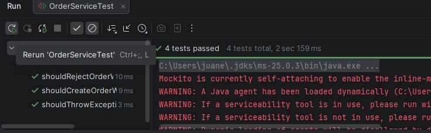
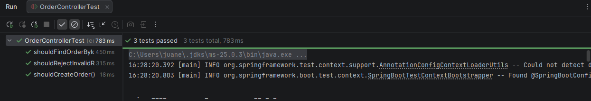
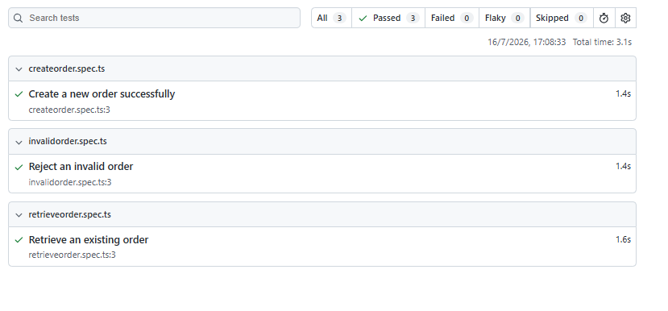
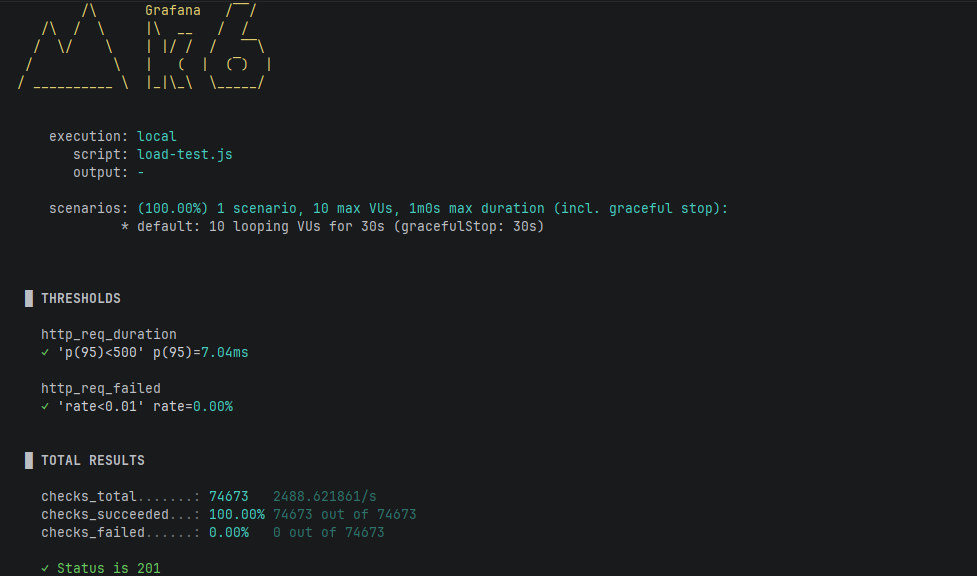
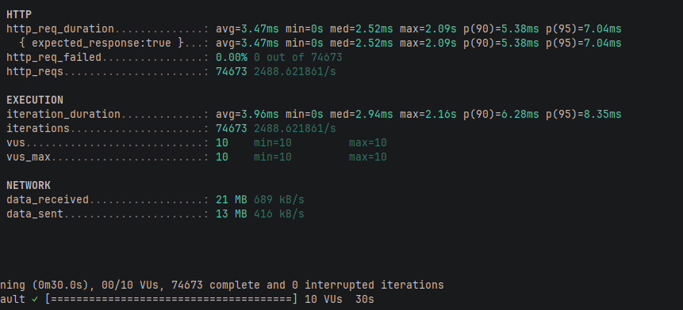

# ARSW - Software Testing Laboratory

## Overview

This laboratory explores a complete software testing strategy for a Spring Boot REST application. The project includes unit testing, controller testing, integration testing, frontend end-to-end testing, and load testing. The objective is to validate software quality from different perspectives while understanding where each testing technique provides the greatest value.

---

# Activity 1 – Unit Testing

## Objective

Extend the service unit tests by validating the retrieval of existing orders and the handling of missing orders.

## Implemented Tests

### Existing Order

The service retrieves an existing order from the repository and returns the corresponding response object.


### Missing Order

The service attempts to retrieve a non-existing order.



---

# Activity 2 – Additional Unit Tests

## Objective

Increase the coverage of the service layer by validating both successful and invalid business scenarios.

### Tested Scenarios

- Create a valid order.
- Reject an order whose total exceeds the maximum allowed value.
- Retrieve an existing order.
- Reject retrieval of a non-existing order.




---

# Activity 3 – Testing Strategy Comparison

## Unit Test

Unit tests validate business logic in complete isolation by mocking all external dependencies. They execute very quickly, are inexpensive to maintain, and provide immediate feedback during development.

---

## MockMvc Test

MockMvc validates the REST controller layer without starting the complete application. These tests verify request validation, HTTP status codes, JSON serialization, and endpoint behavior while remaining relatively fast.

---

## SpringBootTest

Integration tests start the complete Spring context and verify that controllers, services, repositories, and the database work together correctly. Although slower than unit tests, they provide significantly higher confidence because they validate the interaction among all application layers.

---

## Comparison

| Test Type | Speed | Confidence | Maintenance |
|------------|--------|------------|-------------|
| Unit Test | Very High | Medium | Low |
| MockMvc | High | High | Medium |
| SpringBootTest | Medium | Very High | High |

---

# Activity 4 – End-to-End Testing

## Tool

Playwright


## Test Case 1

### Create Order Successfully

**Flow**

1. Open the application.
2. Enter a valid customer identifier.
3. Enter a valid order total.
4. Submit the order.

**Input**

```
Customer ID: CUS-01
Total: 120000
```

**Expected Result**

- Order created successfully.
- HTTP 201 response.
- Order information displayed.

---

## Test Case 2

### Reject Invalid Total

**Flow**

1. Enter customer information.
2. Enter an invalid total.
3. Submit the request.

**Input**

```
Customer ID: CUS-01
Total: 6000000
```

**Expected Result**

- Validation error displayed.
- No order created.
- HTTP 400 response.

---

## Test Case 3

### Retrieve Order by ID

**Flow**

1. Create an order.
2. Search using its identifier.

**Input**

```
Order ID: ORD-1
```

**Expected Result**

- Existing order information is displayed.
- HTTP 200 response.



---

# Activity 5 – Load Testing

## Tool

k6


## Configuration

| Parameter | Value |
|------------|-------|
| Virtual Users | 10 |
| Duration | 30 seconds |
| Endpoint | POST /orders |
| Failure Threshold | Less than 1% |
| Latency Threshold | p95 below 500 ms |


## Executed Command

```bash
k6 run load-test.js
```


## Test Results

| Metric | Result |
|---------|--------|
| Virtual Users | 10 |
| Duration | 30 seconds |
| Total Requests | *(Replace with k6 output)* |
| Failed Requests | *(Replace with k6 output)* |
| Failure Rate | *(Replace with k6 output)* |
| Average Response Time | *(Replace with k6 output)* |
| p95 Latency | *(Replace with k6 output)* |
| Threshold Result | Passed / Failed |





---

## Technical Analysis

The load test evaluates the behavior of the REST API under concurrent traffic. During execution, k6 measures request throughput, latency, and failure rate. The p95 latency metric represents the response time experienced by 95% of all requests and is commonly used to evaluate service performance.

If both configured thresholds are satisfied, the application demonstrates acceptable performance for the evaluated workload.

---

# Integrative Activity – Testing Strategy for an E-commerce Application

## Scenario

The application consists of the following components:

- React frontend
- Spring Boot backend
- PostgreSQL database
- REST API
- Authentication and authorization
- AWS deployment

To ensure software quality, a comprehensive testing strategy should cover every architectural layer, from individual components to the deployed application.

---

## Testing Strategy

| Test Type | Tool | Layer Validated | Pipeline Stage | Errors Detected | Evidence Generated |
|-----------|------|-----------------|----------------|-----------------|-------------------|
| Unit Tests | JUnit 5 + Mockito | Business logic (Services) | Build stage | Incorrect calculations, validation failures, business rule violations | JUnit execution report |
| Controller Tests | Spring MockMvc | REST Controllers | Build stage | Incorrect HTTP responses, invalid request handling, JSON serialization issues | MockMvc test results |
| Integration Tests | Spring Boot Test + Testcontainers | Service, Repository and PostgreSQL | Build stage | Database connectivity, persistence errors, repository failures | Integration test report |
| API Tests | Playwright API Testing | REST API Endpoints | Test stage | Invalid endpoints, incorrect status codes, malformed JSON responses | Playwright execution report |
| End-to-End Tests | Playwright | Complete application workflow | Test stage | Frontend-backend integration issues, navigation errors, broken user flows | HTML Playwright Report |
| Performance Tests | k6 | REST API Performance | Performance stage | High latency, request failures, scalability issues | k6 Metrics Report |
| Security Tests | OWASP ZAP | Authentication and REST API | Security stage | SQL Injection, XSS, insecure headers, authentication vulnerabilities | Security Scan Report |
| Deployment Validation | AWS Health Checks | Production Environment | Deployment stage | Deployment failures, unavailable services, configuration errors | AWS Console and CloudWatch Logs |

---

## Pipeline Execution

The proposed CI/CD pipeline executes tests in the following order:

1. Compile the project.
2. Execute Unit Tests.
3. Execute Controller Tests.
4. Execute Integration Tests with PostgreSQL.
5. Build the application artifact.
6. Execute REST API Tests.
7. Execute End-to-End Tests.
8. Execute Performance Tests using k6.
9. Perform Security Scanning.
10. Deploy to AWS.
11. Run Post-deployment Health Checks.

This sequence allows defects to be detected as early as possible while minimizing deployment risks.

---

## Error Detection

The testing strategy is capable of detecting:

- Business logic errors.
- Validation failures.
- Incorrect HTTP status codes.
- JSON serialization problems.
- Database persistence errors.


---

## Evidence Generated

Each testing phase produces verifiable evidence:

- JUnit execution results.
- MockMvc reports.
- Spring Boot integration test logs.
- Playwright execution report.
- Playwright HTML report.
- k6 performance metrics.
- OWASP ZAP security report.
- AWS deployment logs.
- CloudWatch monitoring dashboards.

---

## Reflection

A comprehensive testing strategy combines multiple testing techniques to maximize software quality.

Unit tests provide immediate feedback during development and efficiently validate business logic. MockMvc tests ensure that REST endpoints correctly process requests and responses without requiring the entire application context. Integration tests validate interactions between application layers, increasing confidence in the overall system behavior.

End-to-end tests verify complete user workflows from the frontend to the backend, while load testing evaluates performance and scalability under concurrent traffic. Together, these testing levels provide confidence that the application is functionally correct, reliable, and capable of supporting production workloads.